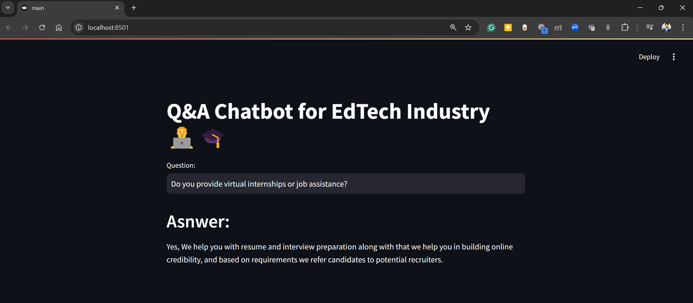
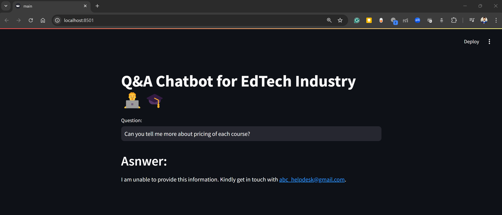

# Q&A Customer Chatbot for EDTech Industry:

 @Author: Priyal Nile  

## 1. Project Description/Highlights: 
- 





## 2. Project Structure: 
 
- 

## 3. Learnings: 
- LangChain,
- Hugging Face,
- Streamlit,
- Google Palm Model

- Additional Learnings:
 - Git & GitHub Setup & Commands,
 - VSCode Setup and Python ENV Configuration,
 - Streamlit: User Interface for Quick Proof Of Concepts

## 4. Installation: 

1. Clone this repository to your local machine using following OR:

```bash
git clone https://github.com/priyalanile/genai_edtech_project.git
```
OR Run following commands in VSCODE -> Project folder (that you created in your system) -> Terminal (Powershell) after you've Logged in to Github & created a Public/Private repository (without README.md file). 
Later, Check by refreshing browser that Github Repository is updated now.

```bash
echo "# genai_edtech_project" >> README.md
git init
git add README.md
git commit -m "first commit"
git branch -M main
git remote add origin https://github.com/priyalanile/genai_edtech_project.git
git push -u origin main
```

2. Setup the Python Environment (env) using the following commands: 
Setting up Python Virtual Environment in VSCODE -> Project folder -> Terminal (DO preferably using CMD i.e. Command Prompt)

- To create a new environment using Conda (Anaconda installation should be in place) from Command prompt in VSCode inside your project directory.

#conda create --name myenv python=3.9
```bash
conda create -p venv python==3.9 -y 
```
- To check if the environment is created or which all envs are present:
```bash
conda info --envs
```

- To activate this newly created environment using Terminal -> CMD & not powershell: (Note: Generally you get this command ready as a part of venv creation log in above step)

```bash
#conda activate C:\Users\priya\VS_Code_Projects\5_GENAI_Edtech_VSCode_Project\venv    
conda activate ./venv 

```

- Incase, you want to deactivate the environment: 

```bash
conda deactivate 
```

- Now when within the env environment, if need to install all python libraries present in requirements.txt: 

```bash
pip install -r requirements.txt 
```

- To check which libraries are installed (within Powershell Terminal of VSCode: 
```bash
pip list | Select-String -Pattern "langchain|langchain_community|google-cloud-aiplatform|google.generativeai|scikit-learn|torch|python-dotenv|ipykernel|streamlit|tiktoken|faiss-cpu|protobuf|google.generativeai|sentence-transformers|InstructorEmbedding|langchain-google-genai|langchain-huggingface"
```
(C:\Users\priya\VS_Code_Projects\5_GENAI_Edtech_VSCode_Project\venv) PS C:\Users\priya\VS_Code_Projects\5_GENAI_Edtech_VSCode_Project>
(C:\Users\priya\VS_Code_Projects\5_GENAI_Edtech_VSCode_Project\venv) PS C:\Users\priya\VS_Code_Projects\5_GENAI_Edtech_VSCode_Project> pip list | Select-String -Pattern "langchain|python-dotenv|streamlit|tiktoken|faiss-cpu|protobuf"

<!-- faiss-cpu                     1.7.4
google-cloud-aiplatform       1.73.0
google-generativeai           0.8.3
InstructorEmbedding           1.0.1
ipykernel                     6.29.5
langchain                     0.3.9
langchain-community           0.3.8
langchain-core                0.3.21
langchain-google-genai        2.0.6
langchain-huggingface         0.1.2
langchain-text-splitters      0.3.2
protobuf                      5.29.0
python-dotenv                 1.0.0
scikit-learn                  1.5.2
sentence-transformers         3.3.1
streamlit                     1.22.0
tiktoken                      0.4.0
torch                         2.5.1
torchvision                   0.20.1 -->


## 5. Usage: 
1. 
2. 
## 6. Possible Future Improvements In this Project: 
- 
- 

----------------------------------------------------------------
----------------------------------------------------------------

### Additional Notes on Git/VSCode/Bugs Issues:

1. conda info --envs #Command to check which envs are available.


